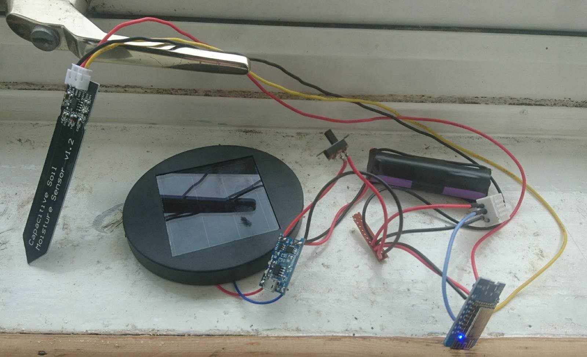
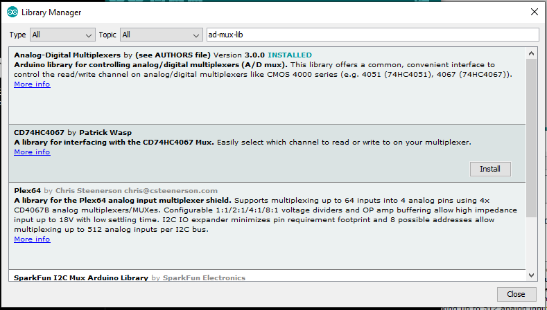

# Stupid Solar Thing

**R. Lloyd**. Lincoln. June 2021.

Any field sensor needs to have a load of boilerplate hardware and firmware before we go hooking a sensor up to it. On the hardware side of things, starting with the power source and ending with the microcontroller, we need:

- Solar Panel
- Charge controller
- Battery
- Microcontroller

In the case of the first prototype, this:

- 2.5v Solar cell
- TP4056 Charge controller circuit
- Random Lipo battery that I'm hoping has enough capacity. It's small.
- Wemos D1 Mini (ESP8266 breakout)

Yeah, Wire that all together... I put a switch in for the Wemos. The output of the TP4056 going to the 5V and GND pins of the Wemos. Seemed appropriate. The Lipo is only chucking out ~4V at the moment, but the ESP is really a 3.3v device that is 5V tolerant (don't quote me on that, but I haven't fried one... yet).

Cool, so we're all done. Chuck a sensor on it and profit? 

Dont be soft in the head. The real key to this little gizmo is going to be the code on the ESP... (I'm calling the microcontroller that from now on because it's just struck me that this would work on an ESP32 based board too. I think).

So this code, what's going to be so magical and ground breaking about it? I hear you ask. Well, probably not much. I'm planning to ~~plagarise~~ fork most of it from other people and put it all together in a system taylored just for ~~me~~ us.

## Operation of the Thing.

Regardless of the sensor that we want to connect to the Thing. It's going to need to perform a few tasks. 

1. Wake up
2. Check the Battery
3. Check the Sensors
4. Save the data
5. Check the time
6. if time
    
    6.1 Connect to wifi

    6.2 Send Some data

7. Go into deep sleep

Now, It's tea time on a saturday. I'll be back in a bit.

---

I've had tea. now it's geekin time.

First things first, I've already made this circuit up. The ESP is curerently connected to wifi and the battery voltage is coming in at 4.5V... this is a bad thing. What's up with the charge controller? Im regretting checking the voltage already.

https://www.best-microcontroller-projects.com/tp4056.html

Ended up watching this next video and the not worrying about it as it's getting dark. The TP4056 has a protection circuit in it, so for now I'm just going to trust that it know's what it's doing and hope the lipo doesn't explode.

https://www.youtube.com/watch?v=dBx-g1dkdDQ

Moving on... That list up there. The first thing that strikes me is that it's incomplete. There are a few other niceties that I would like this device to have.

1. Over-the-air (OTA) updates. 
    - Not strictly necessary, but I can imagine deploying these things in relatively high numbers and I can't see updating them all manually being a fun job.

2. A small webserver that allows people on the same wifi network to log into the sensors directly. Maybe with some sort of passphrase/key used to modify settings.

Of these two items. We already have a webserver from last, bloody hell, months little project:

https://github.com/rwlloyd/p5-javascript-webserver

### Let's add OTA updates next...

OK, if you're into this stuff, Andreas Spiess on Youtube has excellent videos on subject around sensors and microcontrollers.

https://www.youtube.com/watch?v=1pwqS_NUG7Q&t=480s

Notes:

- If our sketch is OTA enabled, we can select a Network port in the arduino IDE rather than a serial port.

- The sketch has to have the OTA not the bootloader. literally, first 2 mins of the video.

Links in the description, but... https://github.com/SensorsIot/ESP32-OTA

### DHT22 Sensor

So that's that bit. Now, I got distracted thinking about how to connect an DHT22 temp/humidity sensor. It's three wires, non of that resistor stuff? I really need to read the datasheets for everything. They should look something like this:-

Excuse me while I just go and add that to the circuit. While I was at it, I also added a capacitive moisture sensor and changed the battery for a 18650 cell I pulled out of an old laptop battery ;). It now looks like this. Don't judge:

Noted should be that this is now on and running sketches.... It also has a different solar panel, because I dont think the 2.5V of the original one is enough to power the TP4056.

---

### Update: 22.59

It's still running sketches. But now it also connects to wifi and spits out sensor readings on the serial port. It also serves a p5.js sketch over http and... one minute while I check.... yep, that all seems to work fine. I've also changed the webserver to the ESP easy. 

Now, I'm getting sick of plugging in the usb. Gonna implement Over-The-Air (OTA) updates from:

https://github.com/SensorsIot/ESP32-OTA

Give me a minute....

Oh yes, this allows debugging over telnet too. So you need to install the 'TelnetStream' Library in the ArduinoIDE. Secondly, if you want to have the credentials for your network done automagically, here are the instructions from the github:

In order to use the code provided in this repository you need to provide the credentials of your access point. Or you can comment out the #include <credentials.h> and define the mySSID and myPASSWORD to the <setupOTA("TemplateSketch", mySSID, myPASSWORD) function.
Provide your credentials

Create a credentials.h file (in the sketch folder directly or in the Arduino library folder). For Windows, the library folder is located in the same folder as the sketch ([...]\Arduino\libraries\Credentials, [...]\Arduino).

The text file credentials.h looks like:

    #pragma once
    const char* mySSID = "SSID of your AP";
    const char* myPASSWORD = "Password of your AP";

## End of the day.

To Summarise. We now have a basic device that can

- Connect to Wifi
- Read Sensors
- Do OTA updates
- Display Debugging information over telnet

it can also 

- Serve webpages... But holy sheet is it a bit slow. Probably the libraries that im using. it took 51102ms to fetch the p5.min.js file of 484kb.

Theres also some stuff in there that I think will connect to a websocket, but that's for another day. Gonna leave everything running tonight and see how much the battery drains withough the solar cell.

### Next steps

Well, I guess it's back to that list at the top. But really the next things on my mind are:

- Displaying the sensor data in a p5js sketch
- Making websockets work
- Probably set up a crude webserver in node or maybe look into node-Red. We're going to have to start saving and graphing this data soon!

---

## Update 7/6/21

Hmm, well, I changed my mind. All this pissing around with websockets and fancy front ends and stuff is silly. Very fun and all that but silly. What we should really be doing is using..

### MQTT > node-red > influxDB > Grafana

I will apologise now for making any subsequent readers go through some of that stuff up there that wasn't relevant.

So, taking the sketch from last night, we're still using the OTA stuff and Telnet monitoring, but really, this thing needs to just communicate it's data as a JSON file over MQTT. We're going to need to manipulate the data on a computer anyway. So that's all done. Theres a new arduino sketch "stupid-solar-dht22-cmoist-mqtt.ino" - What? I like descriptive filenames for these things - that does just this. It check the sensors and then transmits them over wifi to the mqtt broker (I already had on Nyska). It all works. so really, I should build a node-red system for work and learn how to do graphana to make things look pretty. So that's what I'll probably do next.

Also, Future me, implement deep sleep on the ESP. Here's a guide to start with:

https://randomnerdtutorials.com/esp8266-deep-sleep-with-arduino-ide/

Basically,

1. Jumper between D0 and RST
2. Then you just add this when you want to run the deepsleep

        // Deep sleep mode for 30 seconds, 
        // the ESP8266 wakes up by itself when 
        // GPIO 16 (D0 in NodeMCU board) is connected to the RESET pin
        Serial.println("I'm awake, but I'm going into deep sleep mode for 30 seconds");
        ESP.deepSleep(30e6); 
        // Deep sleep mode until RESET pin 
        // is connected to a LOW signal (for example pushbutton or magnetic reed switch)
        //Serial.println("I'm awake, but I'm going into deep sleep mode until RESET pin is connected to a LOW signal");
        //ESP.deepSleep(0); 

If we're going the deepsleep route with the sensor, we might want to look at what's actually necessary for the sketch and trim things down a bit.... it is afterall going to be off most of the time. I think almost everything can be done in the setup. however, I think this will sacrifice OTA updates but we could do some fun things saving a load of data to RTC memory and only transmitting every 10 readings or something? Some more analogue pins would still be nice in the ESP too. However, I quite like the idea of multiplexing. So i think we could have another 5 yet. after 3 moist sensors a dht22 and a battery monitor?

## Update: 13/6/21

OK then, it's been a relatively busy few days and I've done a few things. 

1. I've been testing the prototype sensor. It's not bad but leaves a lot to be desired. Firstly it's chugging through too much power. This is mainly because I have it spewing out data every 2 seconds. So, we need to implement 

    - Longer Time period and deep sleep functionaity
    - Some way of reporting the battery voltage (hint, this makes things slightly complicated) 

2. Why do I want to have the voltage reported you ask? Mainly because there is now a nice way to visualise them! [GRAFANA](https://grafana.com/). I spent a morning setting it up at home. But a new server will need to be set up for future work elsewhere. The crux of it all was a blog post by [Jonathan Oxer at Superhouse](https://www.superhouse.tv/41-datalogging-with-mqtt-node-red-influxdb-and-grafana/). With that you will end up with a raspberry pi including:

    - Raspberry Pi OS
    - Mosquitto (MQTT Broker)
    - Node-RED
    - InfluxDB
    - Grafana

### Moving forward:

- Sort out Deep Sleep
- Work out a way to multiplex multiple analog devices with a single analog pin
- Add Light Dependent Resistor (LDR) to measure light levels
- Add Battery Voltage Measurement (start [here](https://randomnerdtutorials.com/esp8266-adc-reading-analog-values-with-nodemcu/) and [here](https://www.reddit.com/r/esp8266/comments/m4bkdc/how_to_get_battery_level_from_lolin_wemos_130/gquu8dr/))
- Make a schematic in Kicad
- Modify original prototype then build second prototype for field testing.

In the meantime, here are some pretty pictures.
 
 

### It's afternoon now... Let's think about multiplexing

Let's first think about the case where we are not measuring the battery voltage. Generally, simple analog sensors havce 3 pins. Power, GND and SIG. In basic terms, you give power to the sensor and whatever voltage you get at the SIG pin is your reading. In this case, all of the sensors are running at 3.3v and we will expect something below that for our output signal.

Unfortunately, the analog input of the ESP8266 Module will only tolerate 1V. Luckily, the makers of the Wemos, having envisioned this problem, put in a voltage divider so that 3.3V applied to the Wemos Analog in pin will show as 3.3v at the internal ESP analog pin. This is normally a voltage divider with a 100K resistor (R2) to ground, and a 220K resistor (R1) leading to the A0 pin. 

But our battery, when fully charged is 4.2v.... So to drop down the 4.2V to 3.3v, we need to use Ohms law to work out our resistor value...

    V = I x R
    4.2 - 3.3 = 0.9v .... don't be soft, I'm not typing all that out. 

Use a [Calculator](https://ohmslawcalculator.com/voltage-divider-calculator)

Cool, So we add a 110K resistor in series with the 4.2V coming from the battery. We won't max out the Analog pin and all is good with the world... But what about when we want to read something else with the analog pin? We need to be able to switch the wire to the battery... We'll need a switch that can be operated from the microcontroller. NO! Not a fucking relay! a little NPN transistor should do nicely something like this:

In this case, the battery is connected to the collector (1), a digital pin is connected to the base (2) and the emitter (3) is connected to the analog input. BOOM, a pin we can pull high or low to allow electric pixies to flow or not.

## Update 14/6/21

OK, so i did a load of faffing and apparently got most of the way to [this instructables post that explains it very well](https://www.instructables.com/Multiple-Analog-Inputs-on-Only-One-Analoge-Pin/)

So, hows about we get to multiplexing?!

Seriously, I'm just saving you time googling things...

https://www.programmingelectronics.com/arduino-millis-multiple-things/

https://learn.adafruit.com/multi-tasking-the-arduino-part-1/overview

I'm trying to do this with millis() and classes. But in the meantime, I bought some of these:

https://playground.arduino.cc/Learning/4051/

A whole £4 for 10 of them... it's ridiculous. I hope they work at 3.3v... Meh, they look useful anyway.

here's the datasheet for it:

[CD4051 Datasheet](/md-assets/cd4051b.pdf)

## Update 15/6/21
10.48 pm

^^^ I thought - "No" and went to bed.

it's now the 19th and the data looks like this:

Looking pretty good, but it hides a whole host of problems. Primarily that multiplexing the analog pins in software, while keeping track of timings - because you can't use blocking code - keeps breaking OTA updates and deep sleep and so, the CD4051BE (Analog Mutiplexer) chips have arrived and now we'll try using them. The look and work like the picture below

So, as you can see, theres a bitmask to select which input you're reading.... Yeah, possible to roll my own but that's not how programming works. Somone has done this before, so we should use thier code. Thankyou https://ajfisher.me/

~~And thankyou for this library https://github.com/ajfisher/arduino-analog-multiplexer ~~

Actually, scratch that, I've found a different library that will work for different chips (Futureproof?) and is availiable in the default arduino libraries. It's this one:

https://github.com/stechio/arduino-ad-mux-lib

In the add library dialogue in the arduino IDE, search: 

    ad-mux-lib

Then we need to look up how to hook it up using:

    Z ----- common input/output (connected to Arduino Input/Output)
    E ----- enable input (active LOW) (connected to ground (gnd))
    Vee --- negative supply voltage (connected to ground (gnd))
    gnd --- ground (0 V)
    S0-S2 - select inputs (connected to three arduino digitalOut Pins)
    y0-y7 - independent inputs/outputs
    Vcc --- positive supply voltage (5v) 

## Test Mux

Completed code in 

`stupid-solar-thing\inspiration\CD4951-MuxAnalogReadExample-better\`

This code allows you to hook a couple of analog sensors up to a single analog pin and spits them out over serial.

## Make New Prototype

We're staring to get a bit complex with the connections. Up until now I've been drawing schematics on bits of paper here and there but it's mostle been point-to-point soldering and heat shrink. This isn't very professional and is beginning to look like a ratsnest of wires. So, time for [KiCad](https://www.kicad.org/).

... One Hour Later...

It's going fine, but I need a footprint for the TP4056 module. Apparently I already have them for the other bits, so you're on your own there.

https://github.com/alltheworld/tp4056

... Another Half-hour Later....

So, I'm not going to include the tp4056 on the schematic yet for a few reasons.

1. Nobody knows who really makes it, so it's not ideal for production. HOwever the schematics for the module are readily available. For now, the heatshrunk modules will be fine and if we make a proper PCB later, we'll just bake the module into the PCB.
2. The pin footprints of the modules are weird, so it won't fit on a 0.1" spaced prototyping board anyway. 

With that in mind, the schematic is starting to look like this:

Starting top left we have:

- Transistor to turn the power to the sensors on and off (Otherwise we would be powering them all the time)
- DHT22 Temp and humidity sensor, connected to Wemos pin D5
- A resistor to drop the battery voltage below that tolerable by the Wemos/ESP analog pin (I think I discussed this earlier)
- A pin header for the capacitive moisture sensor
- A potential divider for the photoresistor

In the middle, the sensor connections to the Mux chip and wemos. As well as their connection to each other.... look at that lonely wire. I've also added the connection from Wemos D1 to RST this will allow for deep sleep. 

Also, yes, I've already spotted mistakes in the schematic above. But at this point, let's start building the pcb for funsies. Look, this is what greets you once you open the pcb editor

1hr to do the schematic, another hour to remember how the PCB routing software works, 30mins rejigging things to fit properly... Quick preview in the 3D viewer.... Ah, that's a bit of an oversight... Could I say it's a feature, not a bug?

## That's all very well and good. But I'm not being Stupid Enough!

While I was pondering the idiocy of putting the module in  an orientation that means I wont be able to program it in-situ. I realised that I'm making a stupid solar thing. that shouldnt have any sensors, it should just have the connecting points. Up until now I have been making something specific, a prototype, but I should be going even simpler. 

So if we stop at the multiplexer connected to the wemos, we will basically have something similar to an arduino uno with wifi. That will do me.

### Make The Plan

- Make a Wemos D1 mini breakout board that has a load of sensor inputs (via CD4051) that it can turn on and off via a transistor.
- Add a capacitor to the 5V/Battery input of the Wemos.
- Connect CD4051 to A0 and the three select lines.
- Add potential divider to measure battery voltage on 
- Breakout all other MUX inputs and unused Wemod digital outputs to 3 Pin headers. Include RX/TX with +ve and -ve?

Note: Like I said, I'm not being stupid enough. All the sensors will be dealt with with other stupid things.

### Do The Plan

Have I mentioned I hate doing PCB layouts?

I came across this from the arduino forums about 4051s... it seems that everyone has this sort of project in mind. Worth doing well then I guess!

https://forum.arduino.cc/t/4051-and-unused-pins/621019/8

