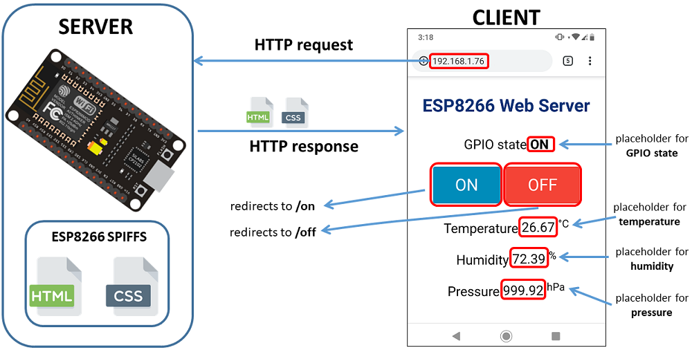

# How to make a stupid-thing

**R. Lloyd**. Lincoln. May 2021.

There's something i've always wondered about this 'internet of things', 'thing'. How do you make one of these Things? What goes into them? I've used things like Tasmota for home automation and those things are basically an esp8266 and a mains relay. What we'll aminly be talking about here is the interface to things. Ther might be a sensor or servo here and there, but i'm more wanting to know about the UI for normal people and the websocket server backend so we're ready for the computer scientisets.

Well, here I am to share what I learn on this rambling journey into the Thingiv... dammit, that's taken... into the World of the Things... yeah, it's not as good.

## The World of the Things

First of all, I'm going to follow this tutorial, because it's using bootstrap as the css and js bit... so I should get the gist of it for when I want to use p5.js and do some sort of cool trippy graphics shit too.. that's a point, what other libraries can you serve? Oh yeah, most importantly, this is all based on the esp8266. Hopefully using SPIFFS... i don't know, I've not got that far yet

[How to create a beautiful Web Interface for projects ESP8266 / ESP32 with Bootstrap](https://diyprojects.io/bootstrap-create-beautiful-web-interface-projects-esp8266/#.YJG5IqEo-Uk)

Yeah.. I didn't follow that tutorial. Follow that tutorial if you're coming at this from knowing how to use bootstrap. the arduino bit is just copypasta.

The search continues...

This looks better:

[ESP8266 Web Server using SPIFFS (SPI Flash File System) – NodeMCU](https://randomnerdtutorials.com/esp8266-web-server-spiffs-nodemcu/)

Ok, this looks good

That will make you:

## 1. Install ESP8266 Board in Arduino IDE

    We’ll program the ESP8266 using Arduino IDE, so you must have the ESP8266 add-on installed. Follow the next tutorial to install it:

    [Install ESP8266 Board in Arduino IDE (Windows, Mac OS X, Linux)](https://randomnerdtutorials.com/how-to-install-esp8266-board-arduino-ide/) .... but you should have done this before now

Holdup... how about I save you the trouble. Go to the github repo:

https://github.com/esp8266/arduino-esp8266fs-plugin

Follow the instructions to install it in the arduino IDE

## 2. Filesystem Uploader Plugin

To upload files to the ESP8266 SPI Flash Filesystem (SPIFFS), we’ll use the Filesystem Uploader Plugin. Install the plugin in your Arduino IDE:

[Install ESP8266 Filesystem Uploader in Arduino IDE](https://randomnerdtutorials.com/install-esp8266-filesystem-uploader-arduino-ide/)

## 3. Installing Libraries

Apparently, one of the easiest ways to build a web server using files from the filesystem is using the [ESPAsyncWebServer](https://github.com/me-no-dev/ESPAsyncWebServer) library. 

## 4. Installing the ESPAsyncWebServer library

This library is not available to download through the Arduino IDE libraries manager. So, you need to follow the next steps to install the library:

[Click here to download the ESPAsyncWebServer library.](https://github.com/me-no-dev/ESPAsyncWebServer/archive/master.zip) You should have a .zip folder in your Downloads folder
Unzip the .zip folder and you should get ESPAsyncWebServer-master folder
Rename your folder from ESPAsyncWebServer-master to ESPAsyncWebServer
Move the ESPAsyncWebServer folder to your Arduino IDE installation libraries folder

Alternatively, you can go to Sketch > Include Library > .zip Library and select the previously downloaded library.

## 5. Installing the ESPAsyncTCP

https://github.com/me-no-dev/ESPAsyncTCP

https://github.com/me-no-dev/ESPAsyncTCP/archive/refs/heads/master.zip

The ESPAsyncWebServer library also needs the ESPAsyncTCP library to operate properly. Follow the next steps to install the ESPAsyncTCP library:

    Click here to download the ESPAsyncTCP library. You should have a .zip folder in your Downloads folder
    Unzip the .zip folder and you should get ESPAsyncTCP-master folder
    Rename your folder from ESPAsyncTCP-master to ESPAsyncTCP
    Move the ESPAsyncTCP folder to your Arduino IDE installation libraries folder
    Finally, re-open your Arduino IDE

Alternatively, you can go to Sketch > Include Library > .zip Library and select the previously downloaded library.
